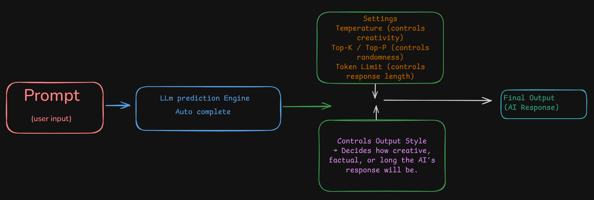

# Prompt and Context Engineering Tutorial for Beginners: A Comprehensive Guide to Effective AI Communication


**Key Takeaways**
- With 46.59B visits, ChatGPT accounts for more than 83% of total traffic among the top 10 chatbots.
- The second most-used chatbot, DeepSeek at 2.74B visits, has barely 6% of ChatGPT’s traffic.
- While traffic is concentrated, the list includes a mix of U.S., Chinese, and European players.

## Understand the Power: Nano Banana and Veo 3

To understand the power of LLMs and prompt engineering go through these tutorials: 

* **[Nano Banana Tutorial: How to Use Google’s AI Image Editing Model in 2025](https://www.anangsha.me/nano-banana-tutorial-how-to-use-googles-ai-image-editing-model-in-2025/)**
* **[Google's Veo 3: A Guide With Practical Examples](https://www.datacamp.com/tutorial/veo-3)**
* **[How to create effective prompts with Veo 3](https://deepmind.google/models/veo/prompt-guide/)**

## Which is the best LLM?

See how leading models stack up across text, image, vision, and beyond. This page gives you a snapshot of each Arena:

https://lmarena.ai/leaderboard

## Use these Prompt Engineering Tools to Learn

https://platform.openai.com/chat/

https://aistudio.google.com/

https://console.anthropic.com/

## Prompt Coach"

Here’s a reusable “Prompt Coach” prompt you can keep handy. You’ll paste this into ChatGPT (or any LLM), then just drop in your messy idea, and it will rewrite it into a polished, effective prompt for you:

Copy Paste this in your LLM:

```
You are my Prompt Coach. I will give you a rough or unclear prompt. 
Your task is to:
1. Clarify it
2. Add missing context
3. Structure it for best results
4. Suggest 2–3 alternative versions (different styles: simple, detailed, structured)

Here’s my rough prompt: [INSERT YOUR PROMPT HERE]
```

## Table of Contents

1. [What is Prompt Engineering?](#what-is-prompt-engineering)
2. [Understanding Large Language Models](#understanding-large-language-models)
3. [Essential Configuration Settings](#essential-configuration-settings)
4. [Fundamental Prompting Techniques](#fundamental-prompting-techniques)
5. [Advanced Prompting Strategies](#advanced-prompting-strategies)
6. [Best Practices for Effective Prompts](#best-practices-for-effective-prompts)
7. [Common Pitfalls and How to Avoid Them](#common-pitfalls-and-how-to-avoid-them)
8. [Hands-On Examples](#hands-on-examples)
9. [Testing and Iteration](#testing-and-iteration)
10. [Resources and Next Steps](#resources-and-next-steps)
11. [Mixture-of-Experts (MoE) and Prompt Engineering](#mixture-of-experts-moe-and-prompt-engineering)
12. [The 6-Part Prompting Framework](https://github.com/panaversity/learn-low-code-agentic-ai/blob/main/00_prompt_engineering/readme.md#the-6-part-prompting-framework)

## What is Prompt Engineering?

Prompt engineering is the art and science of crafting instructions that guide AI language models to produce desired outputs. Think of it as learning to communicate effectively with AI systems to achieve specific goals.

**Why is it important?**
- You don't need to be a programmer to use AI effectively
- Good prompts can dramatically improve AI performance
- It's an iterative skill that improves with practice
- It's becoming essential for productivity in many fields

## Prompt engineering vs. context engineering

Artificial Intelligence (AI) systems like ChatGPT and other **Large Language Models (LLMs)** can generate text, answer questions, write code, or even act as assistants. But to make them work **accurately and reliably**, we need to carefully control **how we talk to them** and **what knowledge we give them**.

Two key techniques help in this process:

1. **Prompt Engineering**
2. **Context Engineering**

---

## 🔹 1. What is Prompt Engineering?

**Prompt Engineering** means **designing and writing effective instructions** (called *prompts*) for the AI so that it produces the desired output.

👉 Think of it like giving **clear directions to a worker**. The clearer you are, the better the worker performs.

### ✨ Key Features of Prompt Engineering:

* **Goal:** Tell the model *how to behave* and *what kind of answer to produce*.
* **Levers (things you can adjust):**

  * Wording of your instruction
  * Output structure (e.g., JSON, bullet points, essay)
  * Roles (e.g., “You are a teacher” or “You are a doctor”)
  * Constraints (e.g., “Answer in 100 words only”)
  * Few-shot examples (showing the AI some input-output pairs as examples)

### ✅ Example:

* Bad Prompt: *“Tell me about climate change.”*
* Good Prompt: *“Write a 100-word summary on climate change in simple English for school students.”*

The second one is **engineered** because it gives **clear structure, audience, and style**.

### ⚠️ Failure Mode:

If prompts are **too vague**, the model may:

* Give incomplete answers
* Use messy formatting
* Produce irrelevant text

### 👨‍💻 Who usually does this?

* UX designers
* App developers
* Product teams

They focus on making AI **user-friendly and reliable**.

---

## 🔹 2. What is Context Engineering?

**Context Engineering** means **curating and providing the right background information** for the AI before it answers.

👉 Think of it like giving the **worker a toolbox and instruction manual** before asking them to fix something.

### ✨ Key Features of Context Engineering:

* **Goal:** Give the model **the facts, documents, or examples** it should rely on when answering.
* **Levers (things you can adjust):**

  * Retrieval (RAG → Retrieval-Augmented Generation)
  * Knowledge bases
  * Company documents (policies, glossaries, FAQs)
  * Tools or APIs (like calculators, search engines)
  * Memory (chat history, saved facts)
  * State across turns (tracking conversation context)

### ✅ Example:

* Without Context: *“What is the company refund policy?”*

  * The model might **guess** based on general knowledge.
* With Context: *Provide the AI with your company’s refund policy PDF.*

  * Now it gives an **accurate, company-specific answer**.

### ⚠️ Failure Mode:

If context is **missing or irrelevant**, the model may:

* Hallucinate (make things up)
* Give outdated answers
* Mislead the user

### 👨‍💻 Who usually does this?

* Data engineers
* Machine Learning (ML) teams
* Platform teams

They manage pipelines, indexing, and retrieval systems to keep AI answers **relevant and up-to-date**.

---

## 🔹 Quick Contrast Table

| **Aspect**         | **Prompt Engineering**                                    | **Context Engineering**                                      |
| ------------------ | --------------------------------------------------------- | ------------------------------------------------------------ |
| **Goal**           | Tell the model how to behave and what to produce          | Provide the facts/examples the model should rely on          |
| **Levers**         | Wording, roles, constraints, structure, few-shot examples | Retrieval (RAG), documents, APIs, memory, state              |
| **Typical Change** | “Be concise. Return valid JSON with fields X/Y/Z.”        | “Attach the company glossary and latest policy PDF.”         |
| **Failure Mode**   | Vague prompts → messy/incorrect output                    | Missing/irrelevant context → hallucinations/outdated answers |
| **Ownership**      | UX/prompt designers, app developers                       | Data/ML/platform teams                                       |

---

## 🔹 How LLMs Actually Work (Background)

To fully understand why **Prompt and Context Engineering** matter, let’s quickly see how **Large Language Models (LLMs)** generate answers:

1. They take your **input text (prompt)**.
2. They predict the **next most likely word** (token).
3. They repeat this prediction many times to form a full response.
4. They base predictions on **patterns learned from massive training data**.

👉 They don’t “understand” like humans do. They are **advanced autocomplete machines**.

---

## 🔹 Key AI Configuration Settings

These settings influence how prompts and contexts affect the output:

* **Temperature (0–1):** Controls creativity.

  * 0 → Factual, consistent answers (math, definitions).
  * 0.7 → Balanced, good for brainstorming.
  * 0.9 → Very creative (poetry, storytelling).

* **Token Limits:** Control how long the output can be.

* **Top-K and Top-P (Nucleus Sampling):** Decide how many possible next words the AI can choose from.

  * Lower values = safe, predictable.
  * Higher values = more diverse, creative.

👉 Example settings:

* **Conservative:** Temp 0.1, Top-P 0.9, Top-K 20
* **Balanced:** Temp 0.2, Top-P 0.95, Top-K 30
* **Creative:** Temp 0.9, Top-P 0.99, Top-K 40

---

## ✅ Final Summary

* **Prompt Engineering = HOW you ask.**
* **Context Engineering = WHAT knowledge you give.**
* Both are required to make AI **accurate, reliable, and useful**.

👉 **Prompt without context:** You might get *generic or vague answers*.
👉 **Context without prompt:** The AI has the info but doesn’t know *how to format or behave*.
👉 **Together:** You get **precise, fact-based, well-structured answers**.

---

⚡ In short:

* Prompt = *Your Question Style*.
* Context = *AI’s Knowledge Library*.
* Combined = *Smart, accurate answers*.

---



Here’s the flow diagram showing how LLMs work:

* You give a Prompt (input) →

* The AI’s Prediction Engine (autocomplete) processes it →

Settings (Temperature, Top-K/Top-P, Token Limit) guide creativity, accuracy, and length →

Finally, you get the AI’s Output (response).


